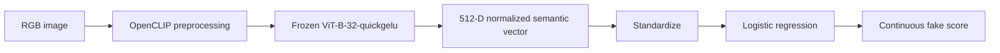

# Real or Fake?

**A transform-robust AI-image detector and live human-versus-machine challenge.**

[Play the live hybrid demo](https://real-vs-ai.pages.dev) ·
[Read the report (PDF)](docs/technical_report.pdf) ·
[Inspect the model card](outputs/model_card.md) ·
[Reproduce the results](#reproduce)

[](LICENSE)
[](https://real-vs-ai.pages.dev)

A lightweight detector for AI-generated images under JPEG compression, blur, resizing, noise,
color jitter, and cropping. The promoted repository model fits a scaled logistic-regression classifier on
frozen OpenCLIP `ViT-B-32-quickgelu` semantic embeddings from balanced CIFAKE, SID-Set, and
WildFake domains. Every training image contributes one clean and one individually augmented view.

Built for **TikTok TechJam 2026, Track 5: Robust Detection of AI-Generated Images Under Real-World
Transformations**.

## Live Demo

The deployed ten-round challenge scores the player and the frozen detector on the same labeled
image, comparing both accuracy and response time. The React frontend runs on Cloudflare Pages; a
FastAPI service on Modal performs OpenCLIP inference on a T4 GPU.

| Choose a side | Compare the calls |
| :---: | :---: |
| [](https://real-vs-ai.pages.dev) | [](https://real-vs-ai.pages.dev) |

### Responsive View


The live flow was rechecked with Chrome DevTools on 1 September 2026 at desktop and mobile
viewports: status, round creation, image delivery, and guess submission all returned HTTP 200 with
no console warnings or errors.

The hosted Modal backend currently reports `ViT-B-32-quickgelu / hybrid_augmented`; the captures
above therefore show the original hybrid deployment. The repository and local demo default to the
newly promoted `semantic_native_mixed` artifact. Modal must be redeployed before the hosted game is
presented as evidence of the new model.

## Results

The promoted `semantic_native_mixed` artifact passed all promotion gates. It was trained on 4,000
REAL and 4,000 FAKE images from each of CIFAKE, SID-Set, and an allowed WildFake partition, with
clean and deterministic augmented views for 48,000 fitting rows. The threshold was calibrated only
on a disjoint 1,000-image SID holdout. Robust AUC is the mean across all 14 individually applied
transform/severity conditions on the 20,000-image CIFAKE test split.

| Metric | Score |
| --- | ---: |
| CIFAKE clean AUC | 0.957820 |
| CIFAKE condition-weighted robust AUC | 0.896636 |
| CIFAKE family-balanced robust AUC | 0.900314 |
| **CIFAKE Final Score**: 0.5 clean + 0.5 robust | **0.927228** |
| SID validation AUC | 0.991900 |
| WildFake COCO/DALL-E evaluation AUC | 0.902925 |
| WildFake LAION/DALL-E matched AUC | 0.912700 |
| Backbone parameters | 151,277,313 frozen + 513 final linear coefficients/intercept |

| Promotion gate | Minimum AUC | Actual AUC | Status |
| --- | ---: | ---: | :---: |
| CIFAKE clean | 0.900000 | 0.957820 | Pass |
| SID calibration | 0.900000 | 0.993972 | Pass |
| SID validation | 0.900000 | 0.991900 | Pass |
| WildFake COCO/DALL-E | 0.700000 | 0.902925 | Pass |
| WildFake LAION/DALL-E matched | 0.750000 | 0.912700 | Pass |

All native gates also require nontrivial score variance, a predicted-FAKE rate between 5% and 95%,
and a higher FAKE median than REAL median. The candidate passed every check before atomically
replacing `outputs/model.joblib`. Feature extraction, fitting, gating, and promotion took 547.063
seconds under a hard 3,600-second budget.

Current artifact SHA-256:
`0c1cf7d6dc1c7ec3b4e3885d5a76d0b1ed7b2908fce7bdb5be4991b9208449cf`. The complete gate records
and per-stage timings are in [outputs/native_metrics.json](outputs/native_metrics.json) and
[outputs/native_training_timing.json](outputs/native_training_timing.json).

### Previous Iteration

The original `hybrid_augmented` iteration achieved a stronger CIFAKE-only composite but failed
catastrophically on native images because its standardized FFT features shifted far outside the
CIFAKE distribution.

| Ablation | Clean AUC | Robust AUC | Final Score |
| --- | ---: | ---: | ---: |
| Semantic, clean training | 0.988755 | 0.917770 | 0.953263 |
| Semantic + FFT, clean training | **0.991760** | 0.910941 | 0.951351 |
| Semantic + FFT, clean + augmented training | 0.988409 | **0.956211** | **0.972310** |

The current model's full tables are [outputs/robustness_table.csv](outputs/robustness_table.csv) and
[outputs/ablation_table.csv](outputs/ablation_table.csv). Historical three-model results are
preserved in [outputs/clean_metrics.json](outputs/clean_metrics.json) and the
[versioned diagnostic summary](outputs/cross_domain_summary.json).

### Cross-Domain Diagnostic

Transformation robustness did not imply generator or source generalization. The first hybrid model
predicted every native image as fake and ranked at chance. That failure led to semantic-only
retraining with native-resolution data, disjoint calibration, and mandatory cross-domain gates.

| Model iteration | SID validation AUC | WildFake COCO/DALL-E AUC | WildFake LAION/DALL-E AUC |
| --- | ---: | ---: | ---: |
| Original hybrid, augmented | 0.497500 | 0.502500 | 0.500000 |
| Original semantic component | 0.886975 | 0.767975 | 0.740600 |
| **Promoted semantic native mix** | **0.991900** | **0.902925** | **0.912700** |

The three native gates remain balanced 400-image diagnostics rather than the full organizer
benchmark. None of their images or hashes entered fitting or calibration. The original protocol,
bootstrap intervals, and failure analysis are in the
[versioned original-model summary](outputs/cross_domain_summary.json). Current-model gate evidence
is in [outputs/native_metrics.json](outputs/native_metrics.json).

## Approach

Each image produces one normalized 512-dimensional OpenCLIP vector. A
`StandardScaler + LogisticRegression` pipeline is fitted with equal class and domain contributions.
The frozen backbone is shared by clean and transformed views; FFT extraction is bypassed for this
artifact.



### Why this isn't a direct replication

A bare frozen-CLIP linear probe is included only as an earlier ablation. The promoted pipeline adds
balanced multi-domain fitting, deterministic family-balanced augmentation, disjoint threshold
calibration, frozen-ID/hash exclusions, and anti-collapse cross-domain promotion gates. The
iteration history reports both the benefit and the failure of the earlier frequency branch.

## Setup

### Windows 11 with AMD Radeon RX 7900 XTX

Requires Python 3.12 and AMD Software: Adrenalin Edition 26.2.2 or newer. The environment below has
been validated locally with Adrenalin 26.6.4, PyTorch 2.9.1, and ROCm 7.2.1.

```powershell
git clone https://github.com/TimSeah/TikTokTechJam2026.git
cd TikTokTechJam2026
uv python install 3.12
uv venv --python 3.12 .venv-amd
.\.venv-amd\Scripts\Activate.ps1
$env:ROCM_SDK_TARGET_FAMILY = "custom"
uv pip install -r requirements-amd.txt
python scripts/check_environment.py --require-gpu --benchmark-clip
```

### Colab, CUDA, or CPU

Use a Python 3.12 environment. Colab already supplies a compatible CUDA build of PyTorch.

```bash
pip install -r requirements.txt
python scripts/check_environment.py --benchmark-clip --batch-size 1 --device cpu
```

Datasets are not committed to the repo; see
[docs/plan/01-data-acquisition/data-acquisition.md](docs/plan/01-data-acquisition/data-acquisition.md)
and [data/README.md](data/README.md). Download CIFAKE with the authenticated Kaggle CLI:

```powershell
.\.venv-amd\Scripts\kaggle.exe datasets download `
  -d birdy654/cifake-real-and-ai-generated-synthetic-images `
  -p data/downloads --unzip
```

## Reproduce

Run from the repository root. On native AMD, set
`$env:ROCM_SDK_TARGET_FAMILY = "custom"` in each new terminal.

```powershell
# 1. Deterministic manifests
python -m src.detector.data --data-root data/downloads --output-dir data/manifests `
  --validate-sample 1000

# 2. Restartable training caches
python -m src.detector.embed --manifest data/manifests/train.csv `
  --data-root data/downloads --output-dir data/features/train-clean `
  --condition clean --device auto --batch-size 512 --workers 8
python -m src.detector.embed --manifest data/manifests/train.csv `
  --data-root data/downloads --output-dir data/features/train-augmented `
  --condition augmented --device auto --batch-size 512 --workers 8
python -m src.detector.embed --manifest data/manifests/test.csv `
  --data-root data/downloads --output-dir data/features/test-clean `
  --condition clean --device auto --batch-size 512 --workers 8

# 3. Acquire disjoint SID and legal WildFake training data
# Repeat --exclude-manifest for every frozen manifest under data/blind-test.
python -m src.detector.acquire_native_data `
  --output-root data/native-train/sid-final --per-class 4000 `
  --eval-per-class 500 --reserve-per-class 100 --workers 8 --retry-rounds 3 `
  --exclude-manifest data/blind-test/sid-validation/manifest.csv `
  --exclude-manifest data/blind-test/wildfake-default/manifest.csv `
  --exclude-manifest data/blind-test/wildfake-laion-matched/manifest.csv `
  --exclude-manifest data/blind-test/wildfake-normalized-same-ids/manifest.csv
python -m src.detector.acquire_wildfake_data `
  --output-root data/native-train/wildfake-final --per-class 4000 `
  --reserve-per-class 100 `
  --exclude-manifest data/blind-test/sid-validation/manifest.csv `
  --exclude-manifest data/blind-test/wildfake-default/manifest.csv `
  --exclude-manifest data/blind-test/wildfake-laion-matched/manifest.csv `
  --exclude-manifest data/blind-test/wildfake-normalized-same-ids/manifest.csv
python -m src.detector.prepare_native_eval

# 4. Extract caches, fit, gate, and promote under a hard one-hour limit
python scripts/train_native_final.py --max-minutes 60 --device auto

# 5. Extract the 14 transformed CIFAKE test caches
$conditions = @(
  'jpeg_q90', 'jpeg_q70', 'jpeg_q50', 'jpeg_q30',
  'blur_sigma0.5', 'blur_sigma1.0', 'blur_sigma2.0',
  'resize_scale0.5', 'resize_scale0.25',
  'noise_sigma0.02', 'noise_sigma0.05', 'noise_sigma0.10',
  'jitter_amount0.20', 'crop_ratio0.80'
)
foreach ($condition in $conditions) {
  python -m src.detector.embed --manifest data/manifests/test.csv `
    --data-root data/downloads --output-dir "data/features/test-$condition" `
    --condition $condition --device auto --batch-size 512 --workers 8
}

# 6. Calculate clean, robustness, and composite-score tables
python -m src.detector.evaluate --model outputs/model.joblib `
  --features-root data/features --output-dir outputs
```

For a quick integration check, add `--limit 200` to feature extraction. Feature shards are written
atomically and existing shards are skipped on restart.

## Inference

```powershell
python src/predict.py --input_dir path/to/images --out preds.json --device auto
python src/predict.py --input_dir path/to/images --out preds.json --device cpu
```

The CLI recursively reads `.jpg`, `.jpeg`, `.png`, and `.webp`, skips corrupt files, and writes a
deterministically ordered JSON list. Its default judge-facing schema is exactly:

```json
[{"image_path": "example.jpg", "pred": 0.731}]
```

`pred` is continuous `P(FAKE)`. `--include_label` optionally adds a human-readable label at the
artifact's calibrated `0.781959` threshold. Inference reads the feature mode from the artifact, so
this semantic model does not compute FFT features.

A fresh two-image smoke test with the promoted artifact passed on AMD and forced CPU: `fake.jpg`
scored `0.989305` on GPU and `0.989272` on CPU, while `real.jpg` scored `0.011023` and `0.010834`.
Both paths produced the same FAKE/REAL labels and required JSON ordering.

Use `--model` to select a compatible artifact, `--batch-size` to tune memory use, and `--workers 0`
when multiprocessing is undesirable. Scores are useful for ranking within the evaluated domain;
they are not calibrated real-world probabilities.

## Run the Demo Locally

The React + FastAPI challenge compares a player's label and response time with the final detector
over ten rounds. It defaults to `outputs/model.joblib` and the local CIFAKE test directory.

```powershell
Set-Location webapp/frontend
npm ci
npm run build
Set-Location ../..
python -m uvicorn webapp.backend.main:app --host 127.0.0.1 --port 8000
```

Open `http://127.0.0.1:8000`, or use the hosted version at
<https://real-vs-ai.pages.dev>. The local API serves the compiled frontend from the same origin;
production serves the frontend and inference API separately. The local backend defaults to the
promoted repository artifact; the hosted backend remains on the historical hybrid until it is
redeployed. Deployment and CI/CD details are in [webapp/README.md](webapp/README.md).

## Repository Layout

```text
LICENSE
data/                        # gitignored datasets, manifests, feature caches
src/
  detector/
    data.py
    transforms.py
    freq_features.py
    features.py
    embed.py
    model.py
    train_probe.py
    evaluate.py
    analyze_errors.py
    acquire_native_data.py      # resumable SID acquisition and disjoint split
    acquire_wildfake_data.py    # legal, source-balanced WildFake acquisition
    train_native_probe.py       # balanced semantic fit and promotion gates
  predict.py                 # image directory -> JSON confidence scores
scripts/
  train_native_final.py      # hard-budget cache, fit, gate, promotion runner
webapp/                      # React + FastAPI human-versus-detector challenge
docs/
  technical_report.pdf       # submission report and blind-test diagnosis
  assets/                     # Chrome DevTools captures used in this README
outputs/
  model.joblib               # committed CPU-loadable inference bundle
  model_card.md
  native_metrics.json        # final promotion gates and data protocol
  native_training_timing.json
  robustness_table.csv
  ablation_table.csv
  error_analysis.md
  trade_offs.md
requirements.txt
```

## Limitations

- CIFAKE is only 32x32 and uses one generated-image process, so strong in-distribution AUC does not
  establish broad modern-generator detection.
- The native SID and WildFake gates contain 400 images each; they are stronger than CIFAKE-only
  validation but are not substitutes for a large hidden cross-generator benchmark.
- The promoted semantic model gives up some CIFAKE clean and transformed AUC to avoid the severe
  native-resolution distribution shift observed in the earlier FFT branch.
- WildFake fitting uses nine allowed source groups and excludes COCO val2017, DALL-E Advanced, every
  frozen evaluation ID, and every frozen evaluation hash. Unseen generators can still differ.
- Probabilities are useful for ranking but are not calibrated for deployment prevalence or every
  image distribution. This prototype must not be the sole basis for moderation, attribution,
  copyright, fraud, or disciplinary decisions.
- Next steps are larger source-disjoint hidden evaluation, compound-transform testing, prevalence
  calibration, and fairness analysis.

## Team

Solo project by Timothy Seah: data pipeline, detector, robustness evaluation, inference CLI,
analysis, and documentation.

## Documentation

- [docs/technical_report.pdf](docs/technical_report.pdf): polished two-column submission report with
  reproducible analytical figures.
- [docs/problem_statement.md](docs/problem_statement.md): full hackathon problem statement (all
  tracks), plus supplementary workshop notes for Track 5 in §5.7.
- [docs/plan/README.md](docs/plan/README.md): original time-boxed strategy and per-phase completion
  records.
- [outputs/model_card.md](outputs/model_card.md): model details and measured limitations.
- [outputs/native_metrics.json](outputs/native_metrics.json): current fitting protocol, threshold,
  and all five promotion-gate results.
- [outputs/native_training_timing.json](outputs/native_training_timing.json): successful 547.063-second
  final training run with per-stage status.
- [outputs/error_analysis.md](outputs/error_analysis.md): four current-model high-confidence
  heavy-blur errors.
- [outputs/trade_offs.md](outputs/trade_offs.md): current CIFAKE, cross-domain, and feasibility
  trade-offs, with the original hybrid retained as comparison evidence.
- [outputs/cross_domain_summary.json](outputs/cross_domain_summary.json): frozen-model blind
  diagnostics, component ablations, and preliminary remediation status.
- [outputs/devpost_description.md](outputs/devpost_description.md): original-model Devpost draft;
  update it for the promoted semantic model before publication.
- [outputs/demo_script.md](outputs/demo_script.md): 2–4 minute demo shot list; the public YouTube URL
  must still be added to Devpost after recording.

## License

MIT, see [LICENSE](LICENSE). CIFAKE and CLIP retain their respective upstream terms.
