# Real or Fake?

**An image detector and a game where you compete against it.**

[Watch the demo video](https://www.youtube.com/watch?v=Uav6HP3sy7I) ·
[Play the live demo](https://real-vs-ai.pages.dev) ·
[Read the report (PDF)](docs/technical_report.pdf) ·
[Inspect the model card](outputs/model_card.md) ·
[Reproduce the results](#reproduce)

[](LICENSE)
[](https://real-vs-ai.pages.dev)

Real or Fake tests whether an image looks AI-generated after changes such as JPEG compression, blur,
resizing, noise, color jitter, and cropping. The detector is a scaled logistic-regression classifier
trained on frozen OpenCLIP `ViT-B-32-quickgelu` embeddings. I trained it on balanced CIFAKE, SID-Set,
and WildFake data, giving each training image one clean view and one individually transformed view.

I built it for **TikTok TechJam 2026, Track 5: Robust Detection of AI-Generated Images Under
Real-World Transformations**.

## Demo Video

https://github.com/user-attachments/assets/0e9c3f95-611f-40de-b80b-9c6b63f31193

Watch the [end-to-end project demo](https://www.youtube.com/watch?v=Uav6HP3sy7I).

## Live Demo

The demo is a ten-round game. In each round, the backend applies one visible, deterministic
transformation and sends the same transformed pixels to both the player and the detector. It compares
accuracy and response time. The React frontend runs on Cloudflare Pages, and a FastAPI service on
Modal runs OpenCLIP inference on a T4 GPU.

| Start the match | Classify the transformed image |
| :---: | :---: |
| [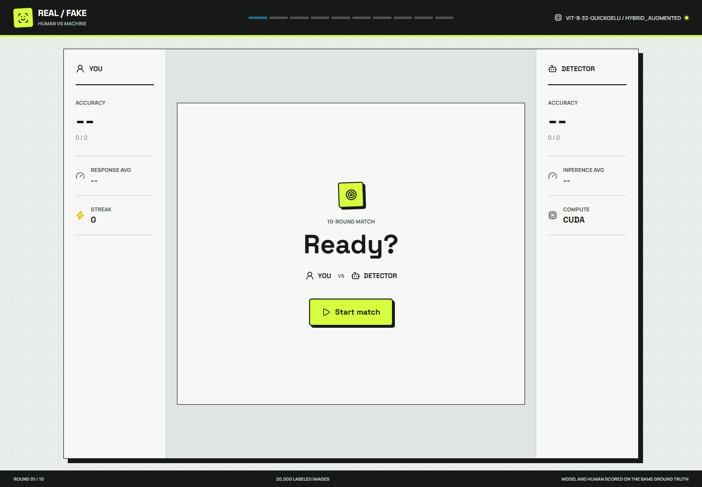](https://real-vs-ai.pages.dev) | [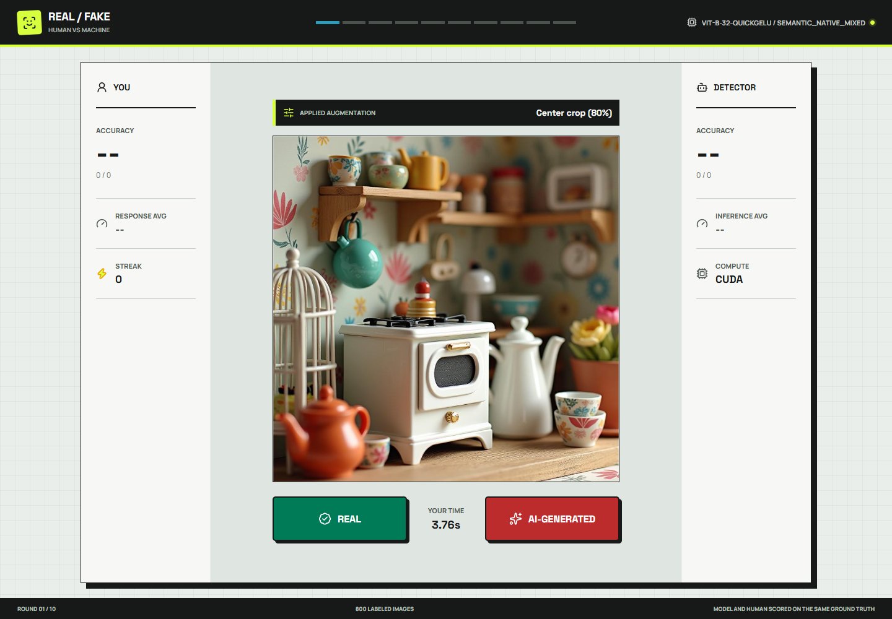](https://real-vs-ai.pages.dev) |

| Compare the calls | Review the final score |
| :---: | :---: |
| [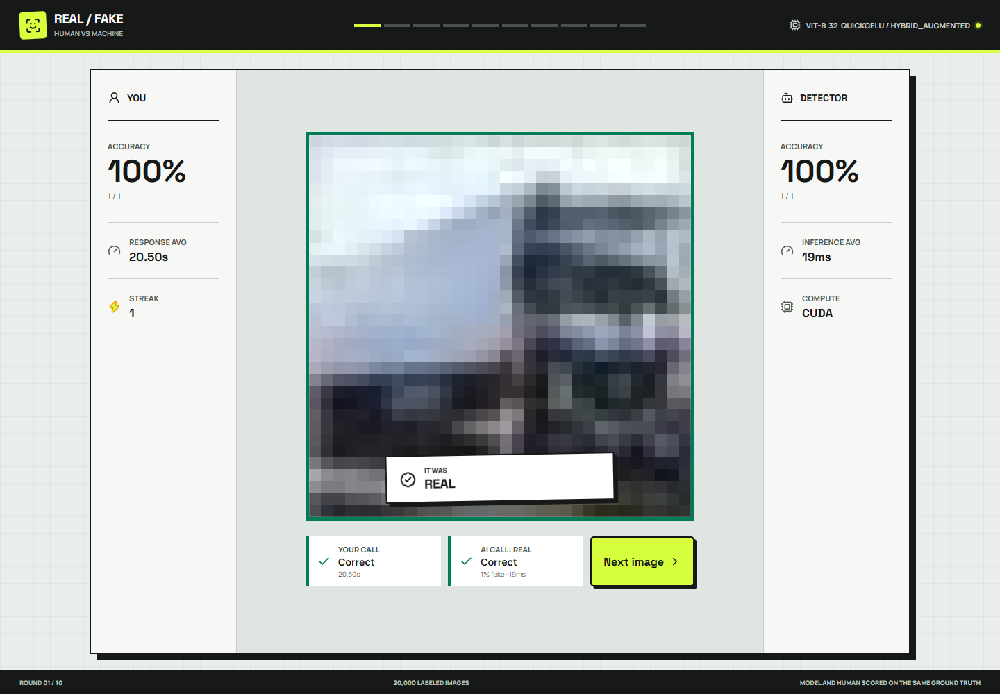](https://real-vs-ai.pages.dev) | [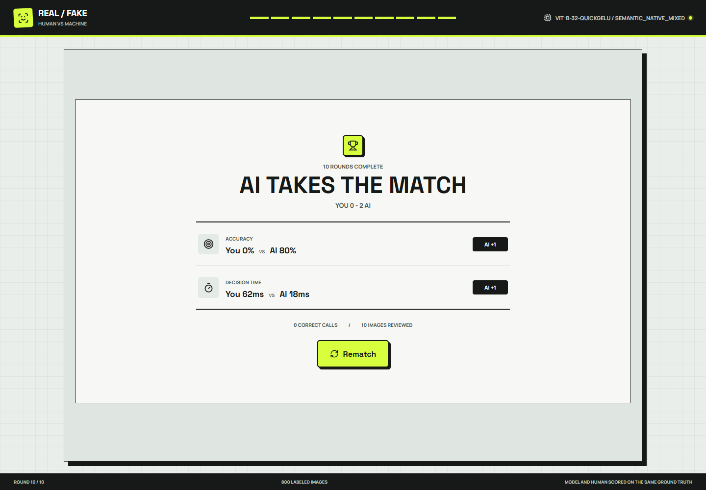](https://real-vs-ai.pages.dev) |

### Responsive View

| Ready | Classify | Final score |
| :---: | :---: | :---: |
| [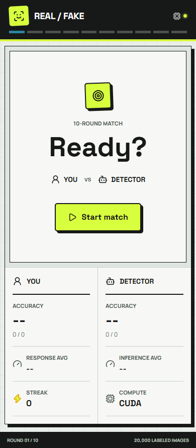](https://real-vs-ai.pages.dev) | [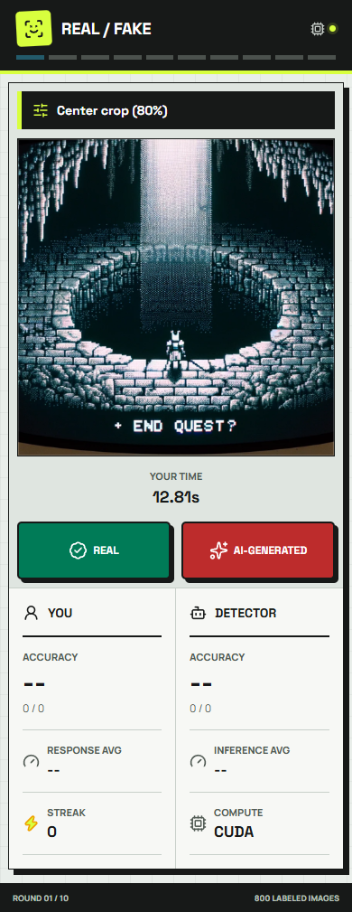](https://real-vs-ai.pages.dev) | [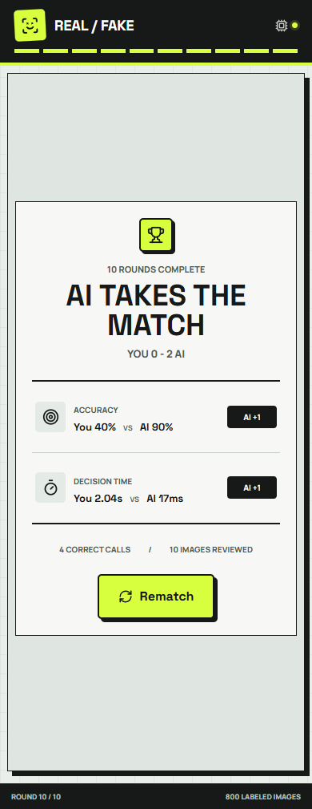](https://real-vs-ai.pages.dev) |

I checked the app with automated unit and integration tests and an end-to-end browser pass on desktop
and mobile. That pass covered the production API, transformed image delivery, gameplay flow, and
responsive layout, with no console errors. The deployed challenge pool has 800 balanced images: 400
REAL and 400 FAKE from SID-Set and WildFake evaluation samples.

The Modal backend runs `ViT-B-32-quickgelu / semantic_native_mixed`, the same model as the artifact
in this repository. The hosted game is therefore using the model described below.

## Results

I selected the `semantic_native_mixed` artifact after it passed the required checks. Training used 4,000
REAL and 4,000 FAKE images from each of CIFAKE, SID-Set, and an allowed WildFake partition. Clean
and deterministic augmented views produced 48,000 fitting rows. I calibrated the threshold only on
a separate 1,000-image SID holdout. Robust AUC is the mean across 14 individually applied
transform/severity conditions on the 20,000-image CIFAKE test split.

| Metric | Score |
| --- | ---: |
| CIFAKE clean AUC | 0.957820 |
| CIFAKE condition-weighted robust AUC | 0.896636 |
| CIFAKE family-balanced robust AUC | 0.900314 |
| **CIFAKE Final Score**: 0.5 clean + 0.5 robust | **0.927228** |
| SID validation AUC | 0.991900 |
| WildFake COCO/DALL-E evaluation AUC | 0.902925 |
| WildFake LAION/DALL-E matched AUC | 0.912700 |
| Backbone parameters | 151,277,313 frozen + 513 final linear coefficients/intercept |

| Promotion gate | Minimum AUC | Actual AUC | Status |
| --- | ---: | ---: | :---: |
| CIFAKE clean | 0.900000 | 0.957820 | Pass |
| SID calibration | 0.900000 | 0.993972 | Pass |
| SID validation | 0.900000 | 0.991900 | Pass |
| WildFake COCO/DALL-E | 0.700000 | 0.902925 | Pass |
| WildFake LAION/DALL-E matched | 0.750000 | 0.912700 | Pass |

The native checks also require nontrivial score variance, a predicted-FAKE rate between 5% and 95%,
and a higher median FAKE score than REAL score. The candidate passed every check before it replaced
`outputs/model.joblib`. Feature extraction, fitting, evaluation, and promotion took 547.063 seconds
under a hard 3,600-second budget.

Artifact SHA-256:
`0c1cf7d6dc1c7ec3b4e3885d5a76d0b1ed7b2908fce7bdb5be4991b9208449cf`. The gate records and
per-stage timings are in [outputs/native_metrics.json](outputs/native_metrics.json) and
[outputs/native_training_timing.json](outputs/native_training_timing.json).

### Previous Iteration

The first `hybrid_augmented` version scored better on the CIFAKE composite, but performed very
poorly on native images. Its standardized FFT features had shifted far outside the CIFAKE
distribution.

| Ablation | Clean AUC | Robust AUC | Final Score |
| --- | ---: | ---: | ---: |
| Semantic, clean training | 0.988755 | 0.917770 | 0.953263 |
| Semantic + FFT, clean training | **0.991760** | 0.910941 | 0.951351 |
| Semantic + FFT, clean + augmented training | 0.988409 | **0.956211** | **0.972310** |

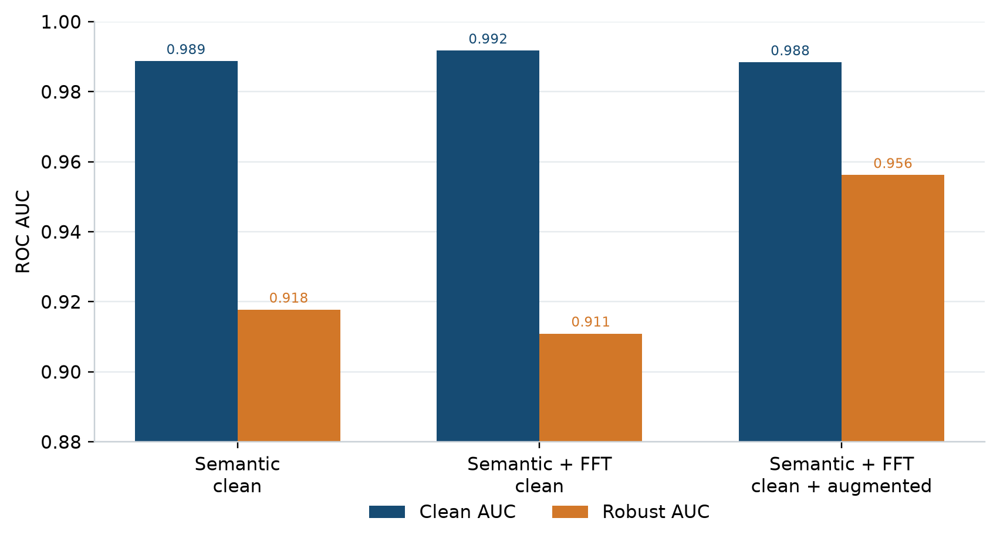

*On this ablation, adding augmented views improved robustness more than adding the FFT branch alone.*

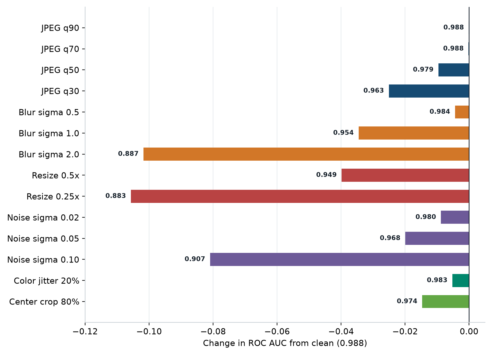

*The augmented hybrid held up best under JPEG compression and moderate transforms. Heavy blur and
quarter-scale resizing were the first conditions below 0.90 AUC.*

The full tables for the current model are in [outputs/robustness_table.csv](outputs/robustness_table.csv)
and [outputs/ablation_table.csv](outputs/ablation_table.csv). The earlier three-model results remain
available in [outputs/clean_metrics.json](outputs/clean_metrics.json) and the
[diagnostic summary](outputs/cross_domain_summary.json).

### Cross-Domain Diagnostic

Performance after transformations did not guarantee generalization to new generators or image
sources. The first hybrid model predicted every native image as fake and ranked close to chance. I
then retrained with semantic features and native-resolution data, kept calibration separate, and
added cross-domain checks before choosing the model above.

| Model iteration | SID validation AUC | WildFake COCO/DALL-E AUC | WildFake LAION/DALL-E AUC |
| --- | ---: | ---: | ---: |
| Original hybrid, augmented | 0.497500 | 0.502500 | 0.500000 |
| Original semantic component | 0.886975 | 0.767975 | 0.740600 |
| **Promoted semantic native mix** | **0.991900** | **0.902925** | **0.912700** |

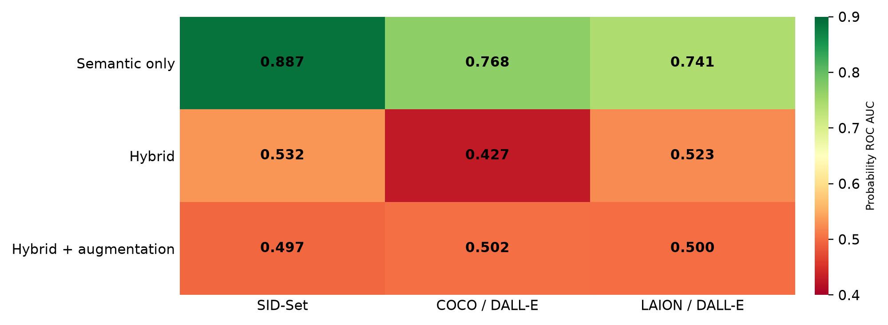

*On these frozen diagnostic samples, the semantic branch retained ranking information; both FFT
hybrids were close to chance.*

The native gates use three balanced 400-image diagnostic sets; they are not the full organizer
benchmark.
None of their images or hashes entered fitting or calibration. The original protocol, bootstrap
intervals, and failure analysis are in the
[original-model summary](outputs/cross_domain_summary.json). Evidence for the current model is in
[outputs/native_metrics.json](outputs/native_metrics.json).

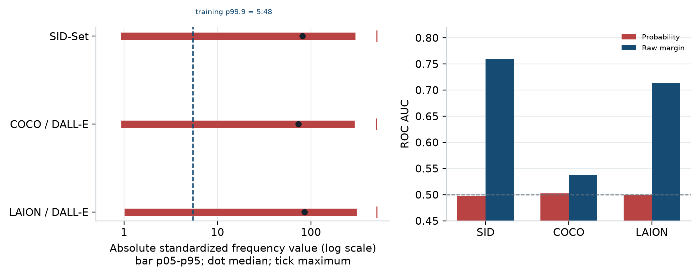

*Native inputs produced standardized frequency values near 500, far outside the training-scale
range. That shift saturated the original hybrid's linear head, so I removed the FFT branch.*

## Approach

For each image, I extract a normalized 512-dimensional OpenCLIP vector and fit a
`StandardScaler + LogisticRegression` pipeline while giving each class and domain equal weight. The
same frozen backbone handles clean and transformed views. The final artifact does not use FFT
features.

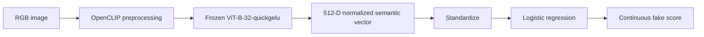

### How the final model differs

The bare frozen-CLIP linear probe is the starting point for comparison. I then added balanced
multi-domain fitting, deterministic family-balanced augmentation, disjoint threshold calibration,
frozen-ID/hash exclusions, and cross-domain checks. The checks showed that the frequency branch helped
on some CIFAKE tests but did not transfer to native-resolution images, so I left it out of the model
used for the demo.

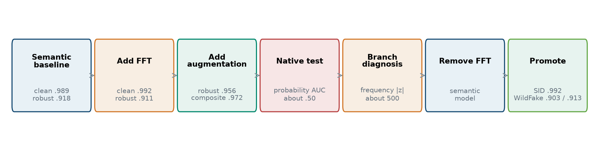

*The experiments moved from a CIFAKE baseline to augmentation, exposed the hybrid's native-resolution
failure, and led to the semantic model used for the demo.*

## Setup

### Windows 11 with AMD Radeon RX 7900 XTX

This setup requires Python 3.12 and AMD Software: Adrenalin Edition 26.2.2 or newer. The environment
below was validated locally with Adrenalin 26.6.4, PyTorch 2.9.1, and ROCm 7.2.1.

```powershell
git clone https://github.com/TimSeah/TikTokTechJam2026.git
cd TikTokTechJam2026
uv python install 3.12
uv venv --python 3.12 .venv-amd
.\.venv-amd\Scripts\Activate.ps1
$env:ROCM_SDK_TARGET_FAMILY = "custom"
uv pip install -r requirements-amd.txt
python scripts/check_environment.py --require-gpu --benchmark-clip
```

### Colab, CUDA, or CPU

Use a Python 3.12 environment. Colab already includes a compatible CUDA build of PyTorch.

```bash
pip install -r requirements.txt
python scripts/check_environment.py --benchmark-clip --batch-size 1 --device cpu
```

The datasets are not committed to the repository. See
[docs/plan/01-data-acquisition/data-acquisition.md](docs/plan/01-data-acquisition/data-acquisition.md)
and [data/README.md](data/README.md). Download CIFAKE with the authenticated Kaggle CLI:

```powershell
.\.venv-amd\Scripts\kaggle.exe datasets download `
  -d birdy654/cifake-real-and-ai-generated-synthetic-images `
  -p data/downloads --unzip
```

## Reproduce

Run these commands from the repository root. On native AMD, set
`$env:ROCM_SDK_TARGET_FAMILY = "custom"` in each new terminal.

```powershell
# 1. Deterministic manifests
python -m src.detector.data --data-root data/downloads --output-dir data/manifests `
  --validate-sample 1000

# 2. Restartable training caches
python -m src.detector.embed --manifest data/manifests/train.csv `
  --data-root data/downloads --output-dir data/features/train-clean `
  --condition clean --device auto --batch-size 512 --workers 8
python -m src.detector.embed --manifest data/manifests/train.csv `
  --data-root data/downloads --output-dir data/features/train-augmented `
  --condition augmented --device auto --batch-size 512 --workers 8
python -m src.detector.embed --manifest data/manifests/test.csv `
  --data-root data/downloads --output-dir data/features/test-clean `
  --condition clean --device auto --batch-size 512 --workers 8

# 3. Acquire disjoint SID and legal WildFake training data
# Repeat --exclude-manifest for every frozen manifest under data/blind-test.
python -m src.detector.acquire_native_data `
  --output-root data/native-train/sid-final --per-class 4000 `
  --eval-per-class 500 --reserve-per-class 100 --workers 8 --retry-rounds 3 `
  --exclude-manifest data/blind-test/sid-validation/manifest.csv `
  --exclude-manifest data/blind-test/wildfake-default/manifest.csv `
  --exclude-manifest data/blind-test/wildfake-laion-matched/manifest.csv `
  --exclude-manifest data/blind-test/wildfake-normalized-same-ids/manifest.csv
python -m src.detector.acquire_wildfake_data `
  --output-root data/native-train/wildfake-final --per-class 4000 `
  --reserve-per-class 100 `
  --exclude-manifest data/blind-test/sid-validation/manifest.csv `
  --exclude-manifest data/blind-test/wildfake-default/manifest.csv `
  --exclude-manifest data/blind-test/wildfake-laion-matched/manifest.csv `
  --exclude-manifest data/blind-test/wildfake-normalized-same-ids/manifest.csv
python -m src.detector.prepare_native_eval

# 4. Extract caches, fit, gate, and promote under a hard one-hour limit
python scripts/train_native_final.py --max-minutes 60 --device auto

# 5. Extract the 14 transformed CIFAKE test caches
$conditions = @(
  'jpeg_q90', 'jpeg_q70', 'jpeg_q50', 'jpeg_q30',
  'blur_sigma0.5', 'blur_sigma1.0', 'blur_sigma2.0',
  'resize_scale0.5', 'resize_scale0.25',
  'noise_sigma0.02', 'noise_sigma0.05', 'noise_sigma0.10',
  'jitter_amount0.20', 'crop_ratio0.80'
)
foreach ($condition in $conditions) {
  python -m src.detector.embed --manifest data/manifests/test.csv `
    --data-root data/downloads --output-dir "data/features/test-$condition" `
    --condition $condition --device auto --batch-size 512 --workers 8
}

# 6. Calculate clean, robustness, and composite-score tables
python -m src.detector.evaluate --model outputs/model.joblib `
  --features-root data/features --output-dir outputs
```

For a quick integration check, add `--limit 200` to feature extraction. Feature shards are written
atomically, and existing shards are skipped when a run is restarted.

## Inference

```powershell
python src/predict.py --input_dir path/to/images --out preds.json --device auto
python src/predict.py --input_dir path/to/images --out preds.json --device cpu
```

The CLI recursively reads `.jpg`, `.jpeg`, `.png`, and `.webp` files, skips corrupt files, and writes
a deterministically ordered JSON list. By default, it uses this judge-facing schema:

```json
[{"image_path": "example.jpg", "pred": 0.731}]
```

`pred` is continuous `P(FAKE)`. `--include_label` optionally adds a human-readable label using the
artifact's calibrated `0.781959` threshold. Inference reads the feature mode from the artifact, so
the semantic model does not compute FFT features.

In a fresh two-image smoke test, the artifact passed on both AMD and forced CPU. `fake.jpg` scored
`0.989305` on GPU and `0.989272` on CPU; `real.jpg` scored `0.011023` and `0.010834`. Both runs
produced the same FAKE/REAL labels and the required JSON ordering.

Use `--model` to select a compatible artifact, `--batch-size` to adjust memory use, and `--workers 0`
to disable multiprocessing. Scores are useful for ranking images within the evaluated domain, but
they are not calibrated real-world probabilities.

## Run the Demo Locally

The React + FastAPI challenge compares the player's label and response time with the final detector
over ten rounds. It uses `outputs/model.joblib` and the local CIFAKE test directory by default.

```powershell
Set-Location webapp/frontend
npm ci
npm run build
Set-Location ../..
python -m uvicorn webapp.backend.main:app --host 127.0.0.1 --port 8000
```

Open `http://127.0.0.1:8000` or use the hosted version at
<https://real-vs-ai.pages.dev>. The local API serves the compiled frontend from the same origin. In
production, the frontend and inference API are served separately. The local backend uses the final
repository artifact; the hosted backend remains on the older hybrid model until it is redeployed.
Deployment and CI/CD details are in [webapp/README.md](webapp/README.md).

## Repository Layout

```text
LICENSE
data/                        # gitignored datasets, manifests, feature caches
src/
  detector/
    data.py
    transforms.py
    freq_features.py
    features.py
    embed.py
    model.py
    train_probe.py
    evaluate.py
    analyze_errors.py
    acquire_native_data.py      # resumable SID acquisition and disjoint split
    acquire_wildfake_data.py    # legal, source-balanced WildFake acquisition
    train_native_probe.py       # balanced semantic fit and promotion gates
  predict.py                 # image directory -> JSON confidence scores
scripts/
  train_native_final.py      # hard-budget cache, fit, gate, promotion runner
webapp/                      # React + FastAPI human-versus-detector challenge
docs/
  technical_report.pdf       # submission report and blind-test diagnosis
  assets/                     # Chrome DevTools captures used in this README
outputs/
  model.joblib               # committed CPU-loadable inference bundle
  model_card.md
  native_metrics.json        # final promotion gates and data protocol
  native_training_timing.json
  robustness_table.csv
  ablation_table.csv
  error_analysis.md
  trade_offs.md
requirements.txt
```

## Limitations

- CIFAKE images are only 32x32 and come from one generated-image process. A strong CIFAKE AUC does
  not show that my model will detect images from current generators in general.
- I used 400-image native SID and WildFake gates. They are more useful than CIFAKE-only validation,
  but they are not a substitute for a large hidden cross-generator benchmark.
- My final semantic model gives up some CIFAKE clean and transformed AUC to avoid the severe
  native-resolution shift I saw with the earlier FFT branch.
- For WildFake fitting, I used nine allowed source groups and excluded COCO val2017, DALL-E Advanced,
  every frozen evaluation ID, and every frozen evaluation hash. Images from unseen generators may
  still behave differently.
- The scores are useful for ranking, but I did not calibrate them for deployment prevalence or every
  image distribution. This prototype should not be used by itself for moderation, attribution,
  copyright, fraud, or disciplinary decisions.
- My next steps are a larger source-disjoint hidden evaluation, compound-transform testing,
  prevalence calibration, and fairness analysis.

## Team

This is a solo project by Timothy Seah. I built the data pipeline, detector, robustness evaluation,
inference CLI, analysis, and documentation.

## Documentation

- [docs/technical_report.pdf](docs/technical_report.pdf): two-column submission report with
  reproducible analytical figures.
- [docs/problem_statement.md](docs/problem_statement.md): full hackathon problem statement (all
  tracks), plus supplementary workshop notes for Track 5 in §5.7.
- [docs/plan/README.md](docs/plan/README.md): original time-boxed plan and per-phase completion
  records.
- [outputs/model_card.md](outputs/model_card.md): details about my model and its measured limitations.
- [outputs/native_metrics.json](outputs/native_metrics.json): my fitting protocol, threshold,
  and all five promotion-gate results.
- [outputs/native_training_timing.json](outputs/native_training_timing.json): final 547.063-second
  training run with per-stage status.
- [outputs/error_analysis.md](outputs/error_analysis.md): four current-model high-confidence
  heavy-blur errors.
- [outputs/trade_offs.md](outputs/trade_offs.md): CIFAKE, cross-domain, and feasibility trade-offs,
  with the original hybrid retained as comparison evidence.
- [outputs/cross_domain_summary.json](outputs/cross_domain_summary.json): frozen-model blind
  diagnostics, component ablations, and remediation notes.
- [outputs/devpost_description.md](outputs/devpost_description.md): publication-ready description of
  the final semantic model and live Human vs Machine challenge.
- [outputs/demo_script.md](outputs/demo_script.md): 2–4 minute demo shot list. Add the public YouTube
  URL to Devpost after recording.

## License

MIT, see [LICENSE](LICENSE). CIFAKE and CLIP retain their respective upstream terms.
