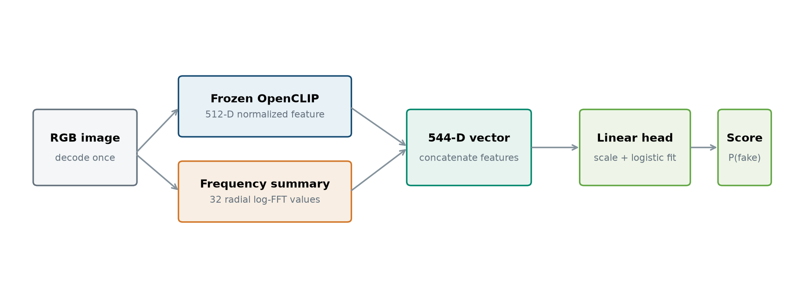

# Real or Fake? Transformation Robustness Does Not Guarantee Cross-Domain Transfer

<!-- markdownlint-disable MD013 -->

**Timothy Seah**<br>
TikTok TechJam 2026, Track 5: Robust Detection of AI-Generated Images Under Real-World Transformations<br>
Technical report, 1 September 2026

> This is a project technical report, not a peer-reviewed publication. It records two distinct model
> stages: the original hybrid candidate and the semantic-only model promoted after blind-test
> diagnosis. Their results and artifact hashes are kept separate throughout.

## Abstract

This project began with a simple idea: combine high-level semantic features with low-level frequency
features, then train the classifier to survive the image transformations used on social media. The
original detector joined a frozen 512-dimensional OpenCLIP embedding with a fixed 32-dimensional
radial Fourier descriptor and fitted a logistic-regression head on CIFAKE.

That hybrid looked strong on the benchmark. It reached 0.988409 clean ROC AUC, 0.956211 mean AUC
across 14 transformation conditions, and a 0.972310 composite score. The ablation showed that
augmentation, rather than the Fourier branch by itself, supplied most of the robustness gain.

The blind tests changed the direction of the project. On balanced SID-Set, COCO/DALL-E, and
LAION/DALL-E samples, the selected hybrid produced probability AUCs of 0.4975, 0.5025, and 0.5000 and
called every image fake. A numerical audit found raw-margin AUCs of 0.7598, 0.5377, and 0.7140: 399,
399, and 400 of 400 probabilities rounded to exactly one, concealing residual ranking on two sets.

I therefore removed the frequency branch and retrained a semantic-only probe on balanced CIFAKE,
SID-Set, and WildFake data with clean and transformed views. The promoted model uses 48,000
clean-plus-augmented rows derived from 24,000 source images and passes the recorded gates with
0.991900 SID validation AUC, 0.902925 COCO/DALL-E AUC, and
0.912700 LAION/DALL-E AUC. This comes with a benchmark trade-off: its CIFAKE clean and robust AUCs are
0.957820 and 0.896636, lower than the original hybrid.

The main result is not that one feature family is always better. It is that post-processing robustness
does not establish transfer under a compound change in generator, source, content, resolution, and
compression history. A benchmark score can select the wrong model unless held-out domains, score
saturation, and branch-level feature ranges are part of promotion.

**Keywords:** AI-generated image detection; transformation robustness; domain shift;
OpenCLIP; frequency analysis; synthetic media forensics.

## 1. Introduction

AI-generated image detectors face two kinds of change. The first is post-processing: JPEG
recompression, blur, resizing, noise, colour adjustment, and cropping. The second is distribution
shift: a new generator, image source, resolution, compression history, or content domain. They can
look similar from the outside because both reduce performance, but they are not the same problem.

TikTok TechJam 2026 Track 5 asks for clean and transformed performance, a continuous confidence
score, reproducible evaluation, and an honest discussion of generalisation and false positives [1].
The workshop also suggests combining semantic and frequency evidence. That was the starting design,
not the final answer.

The work followed four questions:

1. **Can deterministic augmentation preserve ranking across all 14 required transformation and
   severity conditions?**
2. **What do the semantic branch, frequency branch, and augmentation each contribute?**
3. **Does the model selected on CIFAKE transfer under compound source-and-generator shift?**
4. **Can the failure diagnosis lead to a better promotion process and a safer successor model?**

The chronology matters. I first built and selected the hybrid on CIFAKE. I then froze that artifact
before sampling the blind sets. The blind failure led to a branch-level investigation, which led to a
semantic-only, multi-domain retraining run. Presenting only the first score would hide the main
technical lesson; presenting only the final model would hide how that lesson was found.

> **Key finding:** the 0.972310 CIFAKE composite and collapsed blind probabilities answer different
> questions about the same frozen hybrid. The raw-margin audit shows why numerical saturation must
> be separated from ranking failure.

## 2. Related Work

Wang et al. showed that blur and JPEG augmentation can improve transfer for GAN-image detectors [2].
That supports the transformation protocol used here, but it does not establish robustness to every
future generator.

Frank et al. found strong frequency artifacts in GAN-generated images and connected them to upsampling
operations [3]. Their result makes frequency features a reasonable forensic hypothesis. It also gives
a reason to test them carefully across newer generators and source pipelines rather than assuming the
same artifacts remain stable.

Ojha et al. report that simple classifiers on fixed vision-language features can generalise better
than networks trained directly to separate one set of real and fake images [4]. That result motivated
the frozen-CLIP baseline and later supported the semantic-only remediation. PatchCraft takes a
different route, using texture-patch statistics and a benchmark spanning 17 generator types [5]. Both
papers make generator-held-out evaluation central rather than optional.

CLIP itself was trained to associate images and text across broad internet data and is often useful as
a transferable representation [7]. OpenAI's CLIP discussion also describes the gap between benchmark
performance and real-world stress tests [9]. That warning maps closely to what happened here: fitting
a classifier on top of a broad representation can still make the final decision rule narrow.

The three diagrams supplied with the critique were useful layout references, but they are not copied
into this report. Every figure below is original and generated from this repository's architecture or
measured results.

## 3. Model Design and Iteration

### 3.1 Task Definition

Given an RGB image $x$, the detector returns a continuous score $p(x)\in[0,1]$. Larger values rank the
image as more likely to be generated. Labels use $y=0$ for real images and $y=1$ for generated images.
ROC AUC is the primary metric because it evaluates ranking over every threshold. Accuracy and F1 are
secondary diagnostics at a documented threshold.

### 3.2 Original Hybrid Architecture

The original candidate sends each image through two fixed feature paths. The 512-dimensional semantic
feature and 32-dimensional frequency descriptor are concatenated, standardized, and passed to
logistic regression. Only 545 final values are learned; the 151,277,313-parameter OpenCLIP backbone is
frozen.



*Figure 1. The submitted hybrid detector. Blind-test diagnosis later removed the frequency path from
the promoted artifact while retaining the frozen semantic encoder.*

### 3.3 Semantic Branch

The semantic branch uses OpenCLIP `ViT-B-32-quickgelu` with the `openai` checkpoint. If
$f_{\mathrm{CLIP}}(x)\in\mathbb{R}^{512}$ is the image encoder, the stored feature is

$$
s(x)=\frac{f_{\mathrm{CLIP}}(x)}{\lVert f_{\mathrm{CLIP}}(x)\rVert_2}.
$$

Features are extracted under half-precision autocast, normalized in floating point, cached as
`float16`, and promoted to `float32` before classifier fitting. The backbone is unchanged across the
original ablations and the promoted semantic model.

### 3.4 Frequency Branch

The original frequency path converts the image to grayscale, resizes it to $256\times256$, subtracts
the mean, and applies a two-dimensional Hann window. It then computes the log-magnitude spectrum

$$
M(u,v)=\log\left(1+\left|\mathcal{F}\{x_w\}(u,v)\right|\right).
$$

After shifting zero frequency to the centre, the normalized radius is divided into 32 equal-width
bins. Each feature is the mean spectral magnitude in one radial bin:

$$
r_k(x)=\frac{1}{|B_k|}\sum_{(u,v)\in B_k}M(u,v),\qquad k=1,\ldots,32.
$$

The descriptor has no learned parameters. Its problem was not complexity; it was extrapolation after
training-distribution standardization.

### 3.5 Linear Classifier

For the hybrid, $z(x)=[s(x);r(x)]\in\mathbb{R}^{544}$. A `StandardScaler` is fitted on training
features, followed by L2-regularized logistic regression:

$$
p(x)=\sigma\left(w^\top\operatorname{std}(z(x))+b\right).
$$

The interface calls this value `P(FAKE)`, but neither model is calibrated to deployment prevalence. It
is a confidence score, not proof of a literal real-world probability. The saturation audit also uses
the pre-sigmoid margin, which preserves ordering when probabilities tie numerically.

### 3.6 Promoted Semantic-Only Model

The successor removes $r(x)$ and fits the same scaler-plus-logistic-regression pattern on the
512-dimensional semantic feature. Its 24,000 source images are balanced across CIFAKE, SID-Set, and
WildFake, with 4,000 real and 4,000 generated images per domain. One clean and one deterministic
transformed view of each image produce 48,000 fitting rows.

WildFake fitting uses nine allowed groups: ADM, DDPM, GALIP, GigaGAN, VQGAN, VQVAE, AFHQ,
CelebA-HQ, and LSUN-Church. COCO val2017, DALL-E Advanced, and every frozen evaluation identifier are
excluded from fitting. The threshold, 0.7819586396, is selected on a disjoint 500-real/500-generated
SID calibration split by maximizing Youden's $J=\mathrm{TPR}-\mathrm{FPR}$, with ties resolved toward
0.5. The promoted head has 512 coefficients and one intercept.

## 4. Data and Evaluation Protocol

### 4.1 CIFAKE

CIFAKE contains $32\times32$ JPEG images derived from CIFAR-10 real images and generated counterparts
[6]. The published split is preserved:

| Split | Real | Generated | Total | Role |
| --- | ---: | ---: | ---: | --- |
| Train | 50,000 | 50,000 | 100,000 | Original candidate fitting and augmentation |
| Test | 10,000 | 10,000 | 20,000 | Clean and transformed evaluation |

All 20,000 test images are scored under every transformation condition. Test labels are not used for
fitting, but I compared model variants on this matrix, so it is development/model-selection evidence
rather than a final untouched test.

### 4.2 Frozen Blind Samples

The original hybrid artifact was frozen before three balanced 400-image samples were selected. Each
contains 200 real and 200 generated images. Manifests preserve identifiers, paths, labels, dimensions,
byte sizes, and hashes.

| Evaluation | Real source | Generated source | Seed |
| --- | --- | --- | ---: |
| SID validation | SID-Set label 0 | SID-Set label 1 | 2028 |
| WildFake default | COCO val2017 | DALL-E Advanced | 2026 |
| WildFake dimension-matched | LAION-5B | DALL-E Advanced | 2027 |

The frozen hybrid SHA-256 is
`e9bc59e42469c9f7001d7f23f6cbfbdac599e6968148329ef956faefc3427b5e`. Five thousand stratified
bootstrap replicates estimate its 95% AUC intervals.

These sets jointly change generator, real-image source, content, resolution, and compression history;
they do not isolate generator shift. The audit also reports raw margins, saturation, calibration,
metadata-only baselines, exact overlap, and 20 deterministic half-sample sensitivity checks.

### 4.3 Promotion Gates

After the failure was diagnosed, the same held-out source configurations became explicit promotion
gates for the semantic-only successor. The fitting data exclude their identifiers, but the gates were
used to decide promotion. They are therefore strong held-out validation evidence, not a new untouched
post-promotion blind test. A genuinely independent evaluation remains future work.

The promoted artifact SHA-256 is
`0c1cf7d6dc1c7ec3b4e3885d5a76d0b1ed7b2908fce7bdb5be4991b9208449cf`.

### 4.4 Transformations and Metrics

The CIFAKE challenge matrix applies transformations individually. Separate native stress tests also
evaluate three explicitly documented multi-operation chains.

| Family | Evaluation values | Implementation |
| --- | --- | --- |
| JPEG | quality 90, 70, 50, 30 | encode/decode with 4:2:0 subsampling |
| Gaussian blur | $\sigma=0.5,1.0,2.0$ | PIL Gaussian blur |
| Resize | scale 0.5, 0.25, then restore | bicubic downsample and upsample |
| Gaussian noise | $\sigma=0.02,0.05,0.10$ | additive RGB noise and clipping |
| Colour jitter | $\pm20\%$ | brightness, contrast, and saturation |
| Centre crop | retain 80% | crop and bicubic resize to original size |

For augmented fitting, the family and severity are selected deterministically from SHA-256 of the
global seed, image identifier, and transform key. Each image appears once clean and once transformed.

If $A_0$ is clean AUC and $A_j$ is AUC under transformed condition $j$, then

$$
A_{\mathrm{robust}}=\frac{1}{14}\sum_{j=1}^{14}A_j,
\qquad
S=0.5A_0+0.5A_{\mathrm{robust}}.
$$

A secondary family-balanced score first averages within each family and then across the six families.

### 4.5 Compute

Experiments ran on Windows 11 with an AMD Ryzen 7 7800X3D, 32 GB RAM, and Radeon RX 7900 XTX with
24 GB VRAM. The validated environment uses Python 3.12.13, PyTorch 2.9.1 with ROCm 7.2.1,
torchvision 0.24.1, OpenCLIP 3.3.0, NumPy, Pillow, and scikit-learn. The final native feature
extraction, fit, gate evaluation, and promotion pipeline completed in 547.063 seconds under a hard
3,600-second budget.

## 5. What Worked on CIFAKE

### 5.1 Transformation Robustness

The original hybrid performed well across most of the challenge matrix. JPEG remained above 0.96 AUC
even at quality 30. Mild blur, moderate resizing, colour jitter, and cropping also retained useful
ranking. Quarter-scale resizing and blur at $\sigma=2.0$ were the first conditions to fall below 0.90.


*Figure 2. Change from clean AUC for the original hybrid; labels report absolute AUC. Every bar uses
the same 20,000 held-out CIFAKE images.*

The picture is straightforward: the hybrid was robust to ordinary post-processing until the operation
removed a large amount of image information. That is a useful result, but it says nothing yet about a
new generator or source pipeline.

### 5.2 What Actually Supplied the Gain

The ablation separates semantic features, frequency fusion, and augmentation.


*Figure 3. Adding FFT features raises clean AUC from 0.988755 to 0.991760 but lowers robust AUC from
0.917770 to 0.910941. Augmentation lifts robust AUC to 0.956211.*

| Original model | Clean AUC | Robust AUC | Composite |
| --- | ---: | ---: | ---: |
| Semantic, clean | 0.988755 | 0.917770 | 0.953263 |
| Semantic + FFT, clean | **0.991760** | 0.910941 | 0.951351 |
| Semantic + FFT, clean + augmented | 0.988409 | **0.956211** | **0.972310** |

The frequency branch alone did not create robustness. It slightly improved clean ranking while making
the transformed mean worse. The large gain arrived only after the hybrid saw deterministic
transformations during training.

### 5.3 Benchmark Trade-Off After Remediation

The promoted semantic model is deliberately not presented as a free improvement. It gives up CIFAKE
performance in exchange for much better native-resolution transfer.

| Model stage | Clean AUC | Robust AUC | Composite |
| --- | ---: | ---: | ---: |
| Original hybrid candidate | **0.988409** | **0.956211** | **0.972310** |
| Promoted semantic-only model | 0.957820 | 0.896636 | 0.927228 |

For the promoted model, the hardest CIFAKE conditions are blur $\sigma=2.0$ at 0.785540 AUC, resize
0.25 at 0.774426, and noise $\sigma=0.10$ at 0.797451. This trade-off is visible and should not be
hidden behind the stronger native-domain numbers.

## 6. Where the Hybrid Failed

### 6.1 Blind Probabilities Collapsed

The blind result is the centrepiece of the report because it overturns the benchmark selection. The
semantic-only baseline retained ranking information on all three samples. Both hybrid variants emitted
severely saturated probabilities, and the selected augmented hybrid called every image fake at
threshold 0.5.


*Figure 4. Blind probability AUC by frozen model variant. The model selected by the CIFAKE composite
is the bottom row; raw-margin results for that model appear below.*

| Frozen model | SID | COCO / DALL-E | LAION / DALL-E |
| --- | ---: | ---: | ---: |
| Semantic | **0.886975** | **0.767975** | **0.740600** |
| Hybrid | 0.532475 | 0.427500 | 0.523488 |
| Hybrid + augmentation | 0.497500 | 0.502500 | 0.500000 |

The default WildFake sample had an obvious image-size association, but the failure remained in the
LAION dimension-matched configuration where size-only AUC was 0.5. Resolution mismatch by itself does not
explain the collapse.

| Blind set | Probability AUC [95% CI] | Raw-margin AUC [95% CI] | Probabilities exactly 1 |
| --- | ---: | ---: | ---: |
| SID-Set | 0.4975 [0.4925, 0.5000] | 0.7598 [0.7114, 0.8034] | 399 / 400 |
| COCO / DALL-E | 0.5025 [0.5000, 0.5075] | 0.5377 [0.4797, 0.5942] | 399 / 400 |
| LAION / DALL-E | 0.5000 [0.5000, 0.5000] | 0.7140 [0.6629, 0.7630] | 400 / 400 |

### 6.2 Why It Failed

The branch-level values provide a concrete mechanism. I fitted the original frequency standardization
recipe on 200,000 clean-plus-augmented training rows and measured the resulting feature scale. The
training 99.9th percentile of absolute standardized frequency values was 5.48, the training maximum
was 15.34, and the clean CIFAKE test maximum was 12.15.

The blind maxima were 507.99 on SID-Set, 498.14 on COCO/DALL-E, and 505.87 on LAION/DALL-E.


*Figure 5. The blind frequency maxima are about $42\times$ the clean-CIFAKE maximum and
$93\times$ the training 99.9th percentile. The linear head turns this scale shift into strongly
positive logits and a saturated fake score.*

On SID, total hybrid logits ranged from 7.96 to 121.44. Since
$\sigma(7.96)\approx0.99965$, even the minimum was already close to one. Changing a threshold on the
rounded probabilities cannot separate hundreds of ties. The raw margins reveal a more precise result:
ranking survives on SID and LAION/DALL-E, but is weak and statistically compatible with chance on
COCO/DALL-E. The defect is an unusable public score plus unstable transfer, not uniform destruction
of ranking.

The audit also exposes dataset shortcuts. Five-fold metadata-only probes using width, height, byte
size, and aspect ratio reach mean AUCs of 0.971 on SID, 1.000 on COCO/DALL-E, and 0.643 on
LAION/DALL-E. This does not prove that the image model uses those fields, but it shows that labels and
source pipelines are confounded. Exact SHA-256 screening finds no fitting/evaluation overlap; the
LAION/DALL-E manifest contains five repeated files. A difference-hash screen flags a few candidates,
including one cross-label match, so it is a warning rather than proof of duplication.

### 6.3 What the Promoted Model Fixes

The semantic-only successor passed every recorded gate before replacing `outputs/model.joblib`.

| Gate | ROC AUC | Predicted fake rate | Real / fake median | Result |
| --- | ---: | ---: | ---: | --- |
| SID calibration | 0.993972 | 0.5130 | 0.0073 / 0.9990 | Pass |
| SID validation | 0.991900 | 0.5075 | 0.0178 / 0.9993 | Pass |
| COCO / DALL-E | 0.902925 | 0.5275 | 0.1650 / 0.9891 | Pass |
| LAION / DALL-E | 0.912700 | 0.4050 | 0.0075 / 0.9333 | Pass |

The successor fixes the observed saturation and improves held-out ranking. It does not prove universal
generalisation. These datasets influenced promotion, so the next credible test must use generators and
sources not used for fitting, calibration, or model selection.

At the selected threshold, SID confusion counts are TN/FP/FN/TP = 189/11/8/192; COCO/DALL-E counts
are 162/38/27/173; and LAION/DALL-E counts are 183/17/55/145. Their 95% AUC intervals are
[0.9856, 0.9967], [0.8717, 0.9300], and [0.8822, 0.9400]. Balanced-sample Brier scores are 0.049,
0.152, and 0.124, reinforcing that the confidence values are not deployment probabilities.

### 6.4 Native Transformation Stress

| Set | Clean AUC | 14 individual transforms, mean (minimum) | Three heuristic chains, mean |
| --- | ---: | ---: | ---: |
| SID | 0.992 | 0.980 (0.946) | 0.975 |
| COCO / DALL-E | 0.903 | 0.864 (0.735) | 0.771 |
| LAION / DALL-E | 0.913 | 0.907 (0.862) | 0.914 |

The individual matrix applies every challenge transform to each native sample. The three
multi-operation chains combine resize, recompression, colour change, sharpening, and either crop or
noise. They are heuristic re-upload stress tests, not measurements of TikTok's proprietary processing.

## 7. What Changed During the Project

The project was not a straight line from hypothesis to success. Each result changed what I did next.


*Figure 6. The iteration path from a frozen CLIP baseline to a gate-passing semantic-only successor.*

Three lessons came from this sequence.

First, augmentation is local. Training on the same transformation families used in evaluation teaches
useful invariance around CIFAKE. It does not automatically teach invariance to a different generator,
resolution, or source pipeline.

Second, plausible features can become shortcuts. Frequency evidence has a sound forensic motivation,
but an unconstrained linear contribution can dominate when standardized values leave the fitting
range. Branch-level diagnostics were more informative than another aggregate score.

Third, model selection defines what "best" means. The 0.972310 composite selected the right model for
the CIFAKE challenge matrix and the wrong model for broad transfer. Promotion now requires several
checks rather than one weighted score.

## 8. Limitations and Responsible Use

The current evidence has important limits:

- CIFAKE is low-resolution and generator-narrow. Its transformed test set is still based on the same
  underlying dataset and was used for model comparison.
- The original blind samples and current promotion gates contain only 400 images each.
- The promoted model was selected using the native-resolution gates. They are no longer an untouched
  final test.
- WildFake fitting covers nine groups, but many generators, editing systems, artistic styles, and
  capture pipelines remain unseen.
- The native chain tests cover only three hand-specified sequences and do not reproduce a proprietary
  platform pipeline.
- Scores are not calibrated to deployment prevalence and should not be read as literal probabilities.
- Demographic bias, adversarial attacks, partial edits, mixed real/generated images, and fairness were
  not evaluated.
- OpenCLIP may inherit unknown biases from its pretraining data.

This detector is a research prototype. It should not be the sole basis for content removal, account
suspension, copyright decisions, fraud allegations, academic penalties, or claims about authorship.
False positives can harm legitimate creators, while false negatives can create false confidence.
Human review, provenance metadata, source verification, and multiple independent signals remain
necessary.

## 9. Reproducibility

The judge-facing prediction command is:

```powershell
python src/predict.py --input_dir path/to/images --out preds.json --device auto
```

The script recursively finds JPEG, PNG, and WebP files and writes deterministic records with
`image_path` and continuous `pred` values. The artifact validates its schema and feature configuration
and rejects non-finite predictions.

The report-specific snapshot at [report_metrics.json](report_metrics.json) freezes both model stages,
their hashes, plotted values, and provenance. This prevents later promotion runs from silently
rewriting historical figures. All six figures and the PDF are rebuilt with:

```powershell
powershell -ExecutionPolicy Bypass -File scripts/build_technical_report.ps1
```

The figure script uses Pillow and repository data rather than downloaded third-party diagrams.

### Primary Evidence

- [clean CIFAKE metrics](../outputs/clean_metrics.json)
- [current transformation table](../outputs/robustness_table.csv)
- [current robustness summary](../outputs/robustness_summary.json)
- [frozen hybrid blind analysis](../outputs/cross_domain_summary.json)
- [frozen branch diagnostics](../data/blind-test/ablation_results.json)
- [margin, uncertainty, calibration, metadata, and overlap audit](../outputs/shift_audit.json)
- [promoted-model gates](../outputs/native_metrics.json)
- [training and promotion timing](../outputs/native_training_timing.json)
- [native individual and chained stress tests](../outputs/native_stress.json)
- [model card](../outputs/model_card.md)

## 10. Conclusion

The original hybrid solved the problem it was selected to solve. Deterministic augmentation raised its
mean transformed CIFAKE AUC to 0.956211 and its composite to 0.972310. The frequency branch alone did
not produce that gain.

The blind tests then showed that the selected model did not provide a usable confidence score under
compound domain shift: every image was classified fake and almost every probability rounded to one.
Raw-margin AUC recovered to 0.760 on SID and 0.714 on LAION/DALL-E, but remained 0.538 on
COCO/DALL-E. Frequency features about $42\times$ beyond the clean-CIFAKE maximum explained the
numerical saturation.

Removing that branch and training a semantic-only probe on balanced, multi-domain data produced a
better promotion candidate. It passed the recorded SID and WildFake gates, although its CIFAKE
composite fell to 0.927228. That is an engineering trade-off, not a contradiction.

The next step is an independent post-promotion evaluation on generators and source pipelines that did
not influence fitting, calibration, or gating. Until then, the strongest claim supported by this work
is narrow but useful: transformation robustness and compound domain transfer must be measured
separately, and branch-level out-of-distribution checks can prevent a strong benchmark score from
promoting a brittle model.

## References

[1] TikTok TechJam 2026. "Robust Detection of AI-Generated Images Under Real-World
Transformations." Track 5 problem statement and workshop notes, 2026.
[Repository copy](problem_statement.md#5-robust-detection-of-aigenerated-images-under-realworld-transformations).

[2] S.-Y. Wang, O. Wang, R. Zhang, A. Owens, and A. A. Efros. "CNN-Generated Images Are
Surprisingly Easy to Spot... for Now." *CVPR*, 2020. <https://arxiv.org/abs/1912.11035>

[3] J. Frank, T. Eisenhofer, L. Schoenherr, A. Fischer, D. Kolossa, and T. Holz. "Leveraging
Frequency Analysis for Deep Fake Image Recognition." *ICML*, 2020.
<https://arxiv.org/abs/2003.08685>

[4] U. Ojha, Y. Li, and Y. J. Lee. "Towards Universal Fake Image Detectors That Generalize Across
Generative Models." *CVPR*, 2023. <https://arxiv.org/abs/2302.10174>

[5] N. Zhong, Y. Xu, S. Li, Z. Qian, and X. Zhang. "PatchCraft: Exploring Texture Patch for
Efficient AI-Generated Image Detection." arXiv:2311.12397v3, 2024.
<https://arxiv.org/abs/2311.12397>

[6] J. J. Bird and A. Lotfi. "CIFAKE: Image Classification and Explainable Identification of
AI-Generated Synthetic Images." *IEEE Access*, vol. 12, pp. 15642-15650, 2024.
<https://doi.org/10.1109/ACCESS.2024.3356122>

[7] A. Radford et al. "Learning Transferable Visual Models From Natural Language Supervision."
*ICML*, 2021. <https://arxiv.org/abs/2103.00020>

[8] F. Pedregosa et al. "Scikit-learn: Machine Learning in Python." *JMLR*, vol. 12,
pp. 2825-2830, 2011. <https://jmlr.org/papers/v12/pedregosa11a.html>

[9] OpenAI. "CLIP: Connecting Text and Images." 5 January 2021.
<https://openai.com/index/clip/>

[10] SID-Set. Hugging Face dataset repository, revision
`dc03ead57929879319ce30a82bfcfb8d317b10bd`.
<https://huggingface.co/datasets/saberzl/SID_Set>

[11] WildFake. ModelScope dataset repository and TechJam evaluation subset.
<https://modelscope.cn/datasets/hy2628982280/WildFake/summary>

## Appendix A. Claim-to-Artifact Map

| Claim | Primary evidence |
| --- | --- |
| Original clean and ablation metrics | [outputs/clean_metrics.json](../outputs/clean_metrics.json) and [report snapshot](report_metrics.json) |
| Original per-condition robustness | [report snapshot](report_metrics.json) |
| Frozen blind probability AUC | [outputs/cross_domain_summary.json](../outputs/cross_domain_summary.json) |
| Frequency maxima and hybrid logits | [data/blind-test/ablation_results.json](../data/blind-test/ablation_results.json) |
| Margin AUC, confidence intervals, calibration, metadata, and overlap | [outputs/shift_audit.json](../outputs/shift_audit.json) |
| CIFAKE frequency baseline | Cached features and the recipe recorded in [report snapshot](report_metrics.json) |
| Promoted training recipe and gates | [outputs/native_metrics.json](../outputs/native_metrics.json) |
| Promoted per-condition robustness | [outputs/robustness_table.csv](../outputs/robustness_table.csv) |
| Native individual and chained stress tests | [outputs/native_stress.json](../outputs/native_stress.json) |
| Training wall-clock stages | [outputs/native_training_timing.json](../outputs/native_training_timing.json) |
| Current inference contract | [src/predict.py](../src/predict.py) |

## Appendix B. Figure Provenance

| Figure | Question answered | Repository source |
| --- | --- | --- |
| 1. Architecture | What did the original hybrid compute? | Model implementation and [report snapshot](report_metrics.json) |
| 2. Transformations | Where did benchmark performance degrade? | Frozen historical condition values in [report snapshot](report_metrics.json) |
| 3. Ablation | What actually improved robustness? | [clean metrics](../outputs/clean_metrics.json) and [report snapshot](report_metrics.json) |
| 4. Blind heatmap | Which component transferred? | [blind ablation](../data/blind-test/ablation_results.json) |
| 5. Extrapolation | Why did the hybrid saturate? | Feature caches and [blind diagnostics](../data/blind-test/ablation_results.json) |
| 6. Progression | How did evidence change the model? | Historical and promoted-model artifacts above |

<!-- markdownlint-enable MD013 -->