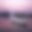
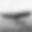
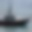
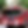

# Error Analysis

The final model was evaluated on 20,000 held-out CIFAKE images under Gaussian blur sigma 2.0, one of
the two weakest conditions. At the fixed 0.5 interpretation threshold, the examples below are the
two most confident false positives and false negatives. Scores are `P(FAKE)`; exact source paths,
IDs, and scores are preserved in [error_examples/examples.csv](error_examples/examples.csv).

## False Positives

### 1. Real image predicted fake, score 0.998206

The heavy blur collapses this real scene into broad pink and blue bands. Fine photographic texture
and boundaries disappear, leaving smooth color fields that resemble generated low-resolution art.

### 2. Real image predicted fake, score 0.993324

The small dark subject becomes an ambiguous silhouette on a nearly uniform background. Both CLIP
semantics and radial frequency structure have little evidence left to establish photographic origin.

## False Negatives

### 1. Fake image predicted real, score 0.003954

The generated image already has a simple dark silhouette and smooth background. Blur removes the
remaining synthesis artifacts while preserving a plausible scene layout, pushing it toward the real
class.

### 2. Fake image predicted real, score 0.004992

Blur suppresses texture around the central red subject and turns the background into natural-looking
color regions. The model appears to rely on the plausible coarse composition after local artifacts
are erased.

## Findings

Heavy blur sigma 2.0 causes the largest clean-relative AUC drop: from 0.988409 to 0.886651. Resize
0.25 is similarly difficult at 0.882709. These transformations remove or reshape exactly the
high-frequency evidence consumed by the FFT branch and also reduce CLIP's semantic detail.

Frequency fusion improves clean AUC from 0.988755 to 0.991760, but the clean hybrid has worse robust
AUC than semantic-only (0.910941 vs. 0.917770). Augmented hybrid training reverses that result and
reaches 0.956211 robust AUC. This supports augmentation as the main robustness contribution; the
image-level explanations above remain hypotheses rather than causal proofs.